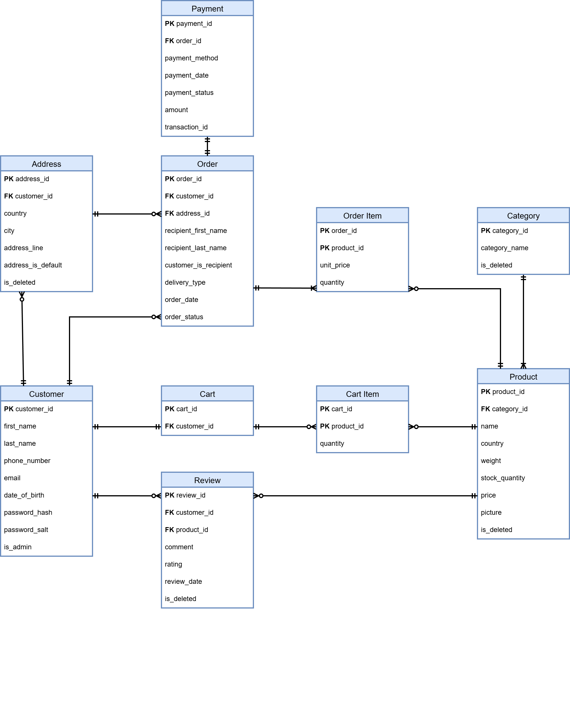

# **Документація схеми бази даних**

## **ER Діаграма**

## **Опис ENUM-ів**

### Enum: `delivery`

- nova_poshta

- ukr_poshta

- meest

### Enum: `payment_type`

- card

- paypal

- apple_pay

- google_pay

### Enum: `status`

- pending

- success

- failed

- refunded

## **Опис таблиць**

### Таблиця: `Customer`

Призначення: Зберігає інформацію про облікові записи користувачів

**Стовпці:**
| Стовпець | Тип | Обмеження | Опис |
|----------|-----|-----------|------|
| customer_id | SERIAL | PRIMARY KEY | Ідентифікатор користувача |
| first_name | VARCHAR(25) | NOT NULL | Ім'я користувача |
| last_name | VARCHAR(25) | NOT NULL | Фамілія користувача |
| phone_number | VARCHAR(13) | UNIQUE, NOT NULL | Номер телефону користувача |
| email | VARCHAR(60) | UNIQUE, NOT NULL | Email користувача |
| password_hash | BYTEA | NOT NULL | Хешована частина паролю |
| password_salt | BYTEA | NOT NULL | Хешована частина паролю |
| date_of_birth | DATE | | Дата народження користувача |
| is_admin | BOOL | | Мітка чи є користувач адміном |

**Індекси:**

- "customer_email_key" на "email" (для пошуку при вході)

- "customer_phone_number_key" на "phone_number" (для можливості у муйбутньому реалізувати вхід у обліковий запис за номером телефону)

**Зв'язки:**

- Один-до-багатьох з "Address" (користувач може мати багато адрес, адреси локальні для кожного користувача)

- Один-до-одного з "Cart" (користувач має одну корзину)

- Один-до-багатьох з "Order_Table" (користувач може мати багато замовлень)

- Один-до-багатьох з "Review" (користувач може мати відгуків)

### Таблиця: `Address`

Призначення: Зберігає інформацію про адреси доставки користувачів.

**Стовпці:**
| Стовпець | Тип | Обмеження | Опис |
|----------|-----|-----------|------|
| address_id | SERIAL | PRIMARY KEY | Ідентифікатор адреси |
| customer_id | INT | FOREIGN KEY | Ідентифікатор користувача |
| country | VARCHAR(70) | NOT NULL | Країна |
| city | VARCHAR(200) | NOT NULL | Місто |
| address_line | VARCHAR(400) | NOT NULL | Адреса |
| address_is_default | BOOL | DEFAULT FALSE | Мітка чи є вказана адреса стандартною за замовчуванням |
| is_deleted | BOOL | DEFAULT FALSE | Мітка soft-видалення адреси |

**Зв'язки:**

- Багато-до-одного з "Customer" (адреса прив'язана до конкретного користувача, користувач може мати багато адрес)

- Один-до-багатьох з "Order_Table" (на одну адресу можна створити багато замовлень)

### Таблиця: `Cart`

Призначення: Зберігає інформацію про корзину кожного користувача.

**Стовпці:**
| Стовпець | Тип | Обмеження | Опис |
|----------|-----|-----------|------|
| cart_id | SERIAL | PRIMARY KEY | Ідентифікатор корзини |
| customer_id | INT | FOREIGN KEY | Ідентифікатор користувача |

**Зв'язки:**

- Один-до-одного з "Customer" (корзина прив'язана до конкретного користувача)

- Один-до-багатьох з "Cart_Item" (у корзині одночасно може бути багато різних товарів)

### Таблиця: `Cart_Item`

Призначення: Зберігає інформацію про товари у корзині.

**Стовпці:**
| Стовпець | Тип | Обмеження | Опис |
|----------|-----|-----------|------|
| cart_id | INT | PRIMARY KEY | Ідентифікатор корзини |
| product_id | INT | PRIMARY KEY | Ідентифікатор товару |
| quantity | INT | | Кількість товару у корзині |

**Зв'язки:**

- Багато-до-одного з "Cart" (товар у корзині прив'язаний до конкретної корзини, товарів у корзині може бути багато)

- Один-до-одного з "Product" (товар у корзині може бути лише одним конкретним)

### Таблиця: `Category`

Призначення: Зберігає інформацію про категорії товарів.

**Стовпці:**
| Стовпець | Тип | Обмеження | Опис |
|----------|-----|-----------|------|
| category_id | SERIAL | PRIMARY KEY | Ідентифікатор категорії |
| category_name | VARCHAR(30) | NOT NULL | Назва категорії |
| is_deleted | BOOL | | Мітка soft-видалення категорії |

**Зв'язки:**

- один-до-багатьох з "Product" (категорія може містити багато продуктів)

### Таблиця: `Order_Table`

Призначення: Зберігає інформацію про замовлення.

**Стовпці:**
| Стовпець | Тип | Обмеження | Опис |
|----------|-----|-----------|------|
| order_id | SERIAL | PRIMARY KEY | Ідентифікатор замовлення |
| customer_id | INT | FOREIGN KEY | Ідентифікатор користувача |
| address_id | INT | FOREIGN KEY | Ідентифікатор адреси |
| recipient_first_name | VARCHAR(25) | NOT NULL | Ім'я отримувача |
| recipient_last_name | VARCHAR(25) | NOT NULL | Фамілія отримувача |
| customer_is_recipient | BOOL | DEFAULT FALSE | Мітка чи є користувач отримувачем замовлення |
| order_date | DATE | DEFAULT "CURRENT_TIMESTAMP"| Дата замовлення |
| order_status | status | | Статус замовлення |
| delivery_type | delivery | | Метод доставки |

**Зв'язки:**

- Один-до-одного з "Address" (замовлення може бути прив'язане тільки на одну адресу)

- Один-до-одного з "Customer" (замовлення може бути закріплене і створене лише за одним користувачем)

- Один-до-багатьох з "Order_Items" (замовлення може бути створене за багатьма товарами одночасно)

- Один-до-одного з "Payment" (замовлення може бути підтверджене лише одним платежем при створенні)

### Таблиця: `Order_Item`

Призначення: Зберігає інформацію про товари у замовленнях.

**Стовпці:**
| Стовпець | Тип | Обмеження | Опис |
|----------|-----|-----------|------|
| order_id | INT | PRIMARY KEY | Ідентифікатор замовлення |
| product_id | INT | PRIMARY KEY | Ідентифікатор товару |
| unit_price | NUMERIC(8,2) | | Ціна товару на момент замовлення |
| quantity | INT | | Кількість замовленого товару |

**Зв'язки:**

- Багато-до-одного з "Order_Table" (замовлення може містити багато товарів)

- Один-до-одного з "Product" (конкретний товар у замовленні може бути лише одним конкретним товаром)

### Таблиця: `Payment`

Призначення: Зберігає інформацію про транзакції при створенні замовлення.

**Стовпці:**
| Стовпець | Тип | Обмеження | Опис |
|----------|-----|-----------|------|
| payment_id | SERIAL | PRIMARY KEY | Ідентифікатор платежу |
| order_id | INT | FOREIGN_KEY | Ідентифікатор замовлення |
| order_date | DATE | | Дата замовлення |
| amount | NUMERIC(9,2) | | Сума платежу |
| transaction_id | VARCHAR(400) | | Ідентифікатор транзакції (внутрішнього у провайдера) |
| payment_status | status | | Статус платежу |
| payment_type | payment_type | | Тип платежу |

**Зв'язки:**

- Один-до-одного з "Order_Table" (платіж може бути тільки за одним замовленням)

### Таблиця: `Product`

Призначення: Зберігає інформацію про транзакції при створенні замовлення.

**Стовпці:**
| Стовпець | Тип | Обмеження | Опис |
|----------|-----|-----------|------|
| product_id | SERIAL | PRIMARY KEY | Ідентифікатор товару |
| category_id | INT | FOREIGN KEY | Ідентифікатор категорії |
| product_name | VARCHAR(200) | NOT NULL | Назва товару |
| product_country | VARCHAR(70) | NOT NULL | Країна товару |
| weight | NUMERIC(5,2) | | Вага товару |
| stock_quantity | INT | | Кількість доступного для замовлення товару |
| price | NUMERIC(8,2) | | Ціна товару |
| is_deleted | BOOL | DEFAULT FALSE| Мітка soft-видалення товару |
| picture | BYTEA | NOT NULL | Зображення товару |

**Зв'язки:**

- Один-до-багатьох з "Cart_Item" (товар може бути доданий у багато корзин)

- Один-до-одного з "Category" (товар може бути закріплений лише за одною категорією)

- Один-до-багатьох з "Order_Item" (товар може бути частиною багатьох замовлень)

- Один-до-багатьох з "Review" (товар може мати багато відгуків)

### Таблиця: `Review`

Призначення: Зберігає інформацію про відгуки користувачів.

**Стовпці:**
| Стовпець | Тип | Обмеження | Опис |
|----------|-----|-----------|------|
| review_id | SERIAL | PRIMARY KEY | Ідентифікатор відгуку |
| customer_id | INT | FOREIGN KEY | Ідентифікатор користувача |
| product_id | INT | FOREIGN KEY | Ідентифікатор товару |
| review_comment | VARCHAR(350) | NOT NULL | Вміст відгуку |
| rating | INT | | Оцінка |
| review_date | DATE | DEFAULT "CURRENT_TIMESTAMP"| Дата відгуку |
| is_deleted | BOOL | DEFAULT FALSE| Мітка soft-видалення відгуку |

**Зв'язки:**

- Багато-до-одного з "Customer" (один користувач може залишити багато відгуків)

- Багато-до-одного з "Product" (один товар може мати багато відгуків)
